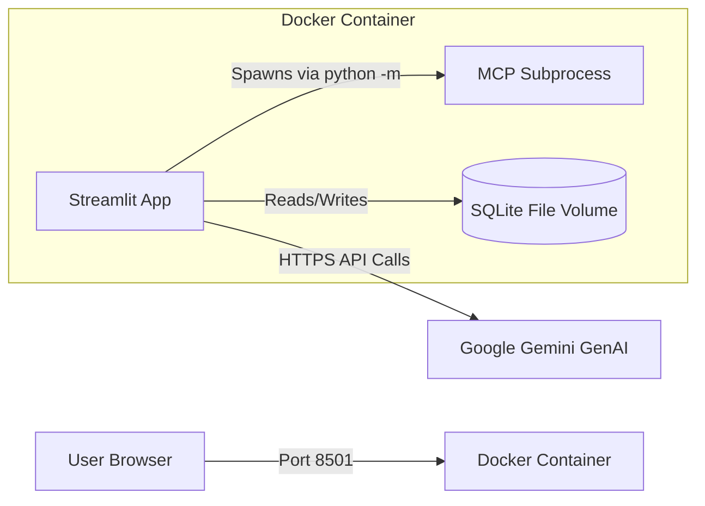

# Deployment Architecture

The application is containerized using Docker, bundling the Streamlit UI and the FastMCP subprocess into a single easily deployable artifact.

```mermaid
graph LR
    User[User Browser] -->|Port 8501| Docker[Docker Container]
    
    subgraph Docker Container
        UI[Streamlit App]
        MCP[MCP Subprocess]
        DB[(SQLite File Volume)]
        
        UI -- "Spawns via python -m" --> MCP
        UI -- "Reads/Writes" --> DB
    end
    
    UI -- "HTTPS API Calls" --> Gemini[Google Gemini GenAI]
```
