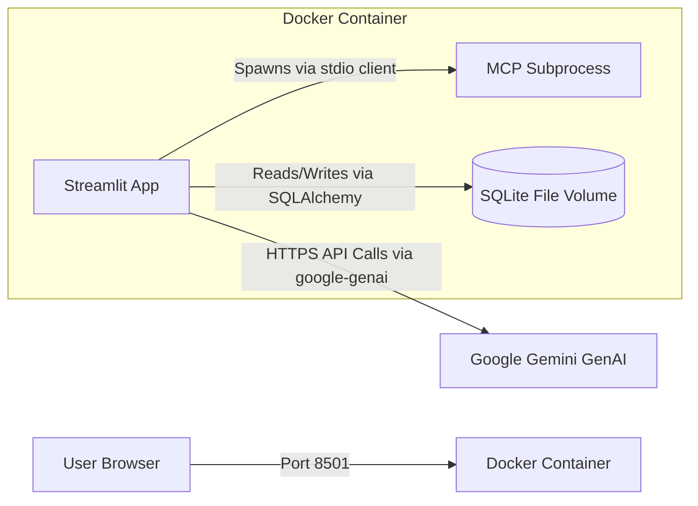

# Deployment Architecture

**Version:** 1.0.0  
**Last Updated:** 2026-07-06  

The application is containerized using Docker, bundling the Streamlit UI and the FastMCP subprocess into a single easily deployable artifact.

