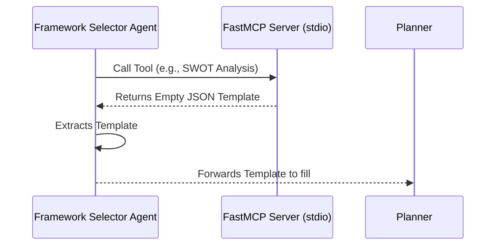

# MCP Communication

The Model Context Protocol (MCP) server provides an agnostic interface for AI agents to retrieve structured thinking frameworks over local STDIO.

```mermaid
sequenceDiagram
    participant FS as Framework Selector Agent
    participant MCP as FastMCP Server (stdio)
    
    FS->>MCP: Call Tool (e.g., SWOT Analysis)
    MCP-->>FS: Returns Empty JSON Template
    FS->>FS: Extracts Template
    FS-->>Planner: Forwards Template to fill
```
