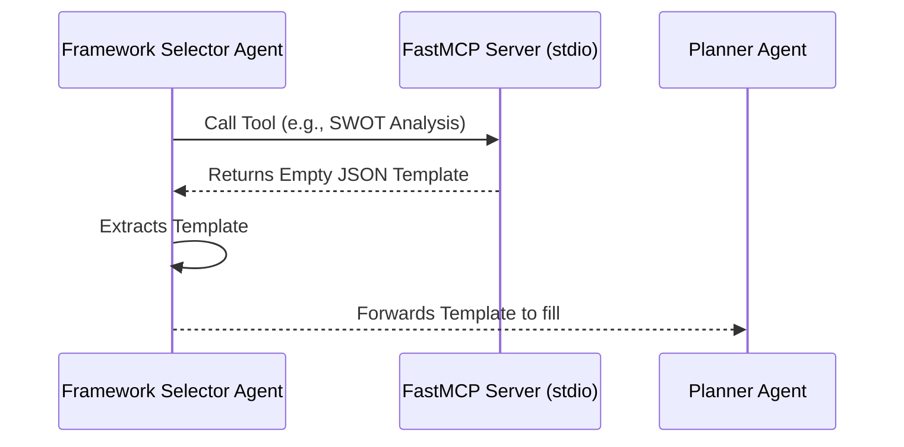

# MCP Communication

**Version:** 1.0.0  
**Last Updated:** 2026-07-06  

The Model Context Protocol (MCP) server provides an agnostic interface for AI agents to retrieve structured thinking frameworks over local STDIO. It is designed to offload specific structure definitions from the LLM prompt.

