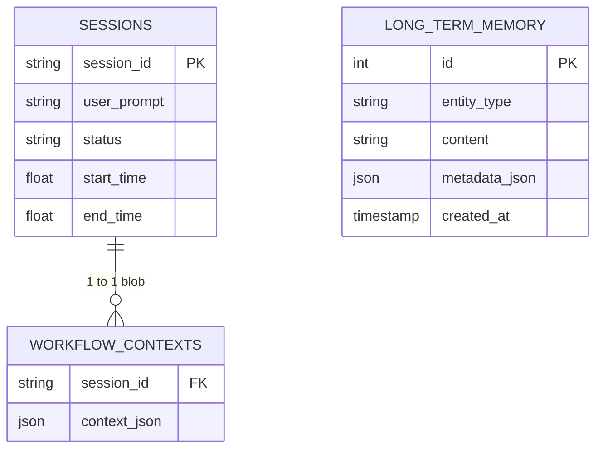

# Memory Architecture

ThinkFlow uses an offline-first SQLite database architecture providing both short-term session continuity and long-term knowledge extraction.

```mermaid
erDiagram
    SESSIONS ||--o{ WORKFLOW_CONTEXTS : "1 to 1 blob"
    SESSIONS {
        string session_id PK
        string user_prompt
        string status
        float start_time
        float end_time
    }
    WORKFLOW_CONTEXTS {
        string session_id FK
        json context_json
    }
    LONG_TERM_MEMORY {
        int id PK
        string entity_type
        string content
        json metadata_json
        timestamp created_at
    }
```
