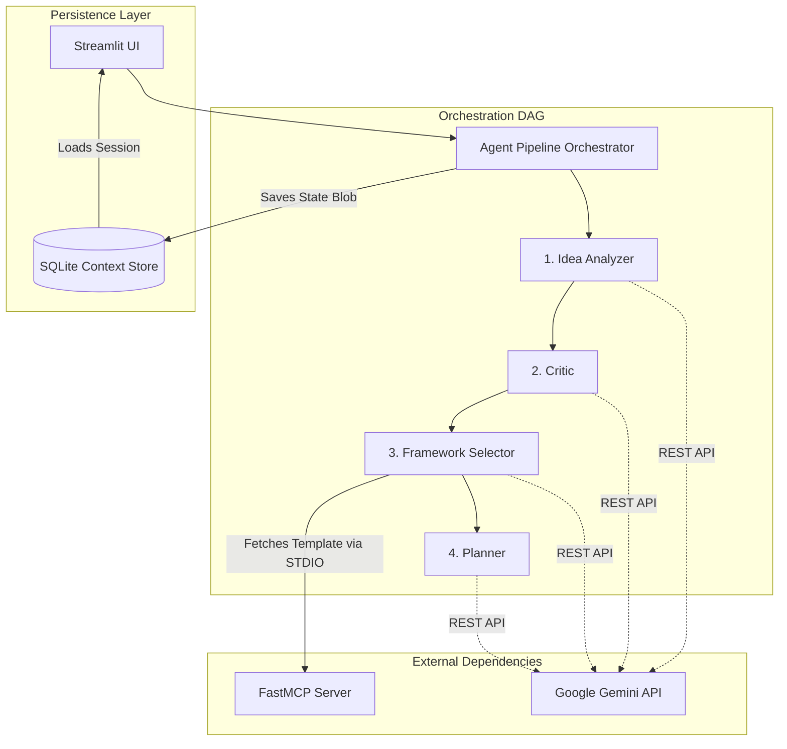

# Overall Architecture

**Version:** 1.0.0  
**Last Updated:** 2026-07-06  

ThinkFlow Studio is built on a decoupled, multi-agent architecture designed for highly deterministic output generation. It eschews generic LLM routing in favor of a strict Directed Acyclic Graph (DAG) and local Model Context Protocol (MCP) tool fetching. This approach prevents cognitive overload and schema hallucination by isolating distinct reasoning phases into their own tightly-scoped agents.

### Core Design Principles

1. **Deterministic State Transitions:** Agents do not call each other recursively. The pipeline governs the flow of Pydantic models from one stage to the next.
2. **Decoupled Thinking Frameworks:** Agents do not hardcode complex business models (like SWOT). Instead, the MCP server provides these templates dynamically, preventing the LLM from drifting from the requested format.
3. **Dual-Schema Validation:** For complex outputs, the system uses an LLM-specific schema that serializes complex objects as JSON strings, which are then parsed natively into Python dictionaries, bypassing the strict `additionalProperties: false` limitation of standard API structured outputs.
