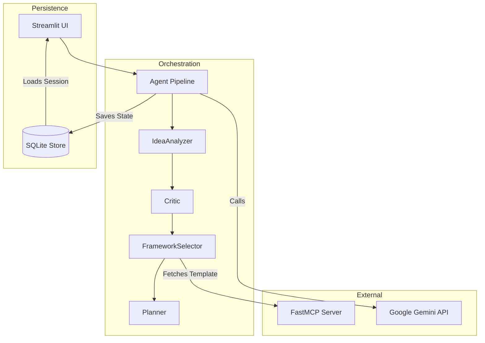

# Overall Architecture

ThinkFlow Studio is built on a decoupled, multi-agent architecture designed for highly deterministic output generation. It eschews generic LLM routing in favor of a strict Directed Acyclic Graph (DAG) and local Model Context Protocol (MCP) tool fetching.

