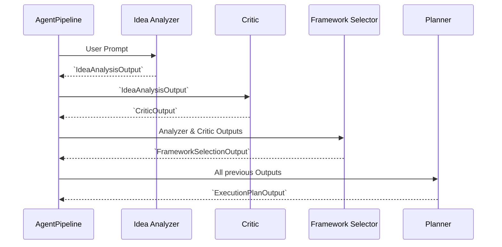

# Pipeline Architecture

The pipeline replaces loosely coupled agent queries with a strict, state-managed execution sequence.

```mermaid
sequenceDiagram
    participant Pipe as AgentPipeline
    participant A as Idea Analyzer
    participant Cr as Critic
    participant FS as Framework Selector
    participant P as Planner

    Pipe->>A: User Prompt
    A-->>Pipe: `IdeaAnalysisOutput`
    
    Pipe->>Cr: `IdeaAnalysisOutput`
    Cr-->>Pipe: `CriticOutput`
    
    Pipe->>FS: Analyzer & Critic Outputs
    FS-->>Pipe: `FrameworkSelectionOutput`
    
    Pipe->>P: All previous Outputs
    P-->>Pipe: `ExecutionPlanOutput`
```
