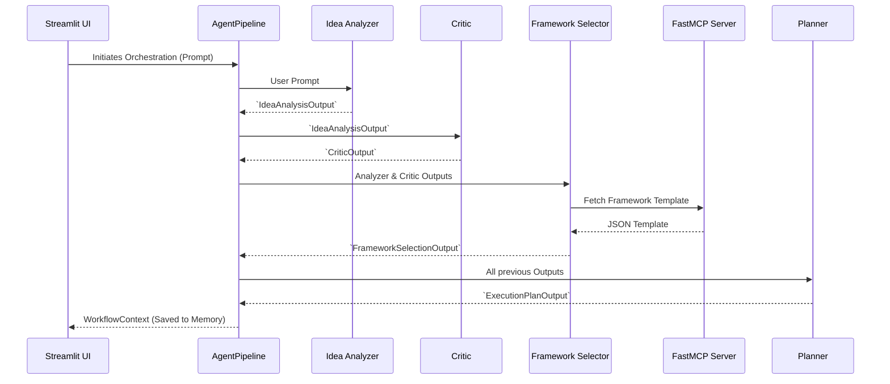

# Pipeline Architecture

**Version:** 1.0.0  
**Last Updated:** 2026-07-06  

The pipeline replaces loosely coupled agent queries with a strict, state-managed execution sequence. It ensures that the context from each agent is deterministically passed to the next agent in the sequence.

